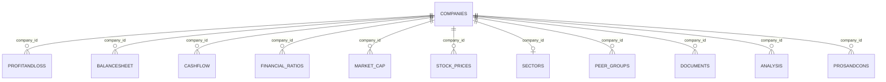

# 🏦 N100 Financial Intelligence Platform

> **A comprehensive financial data engineering & analytics platform for India's Nifty 100 companies**

[](https://python.org)
[](https://sqlite.org)
[](LICENSE)

**Author:** CH Kaushik

---

## 📋 Overview

The N100 Financial Intelligence Platform is an end-to-end data engineering and analytics solution that ingests, validates, and serves financial data for **92 Nifty 100 companies** across **12 source datasets**. Built with a robust ETL pipeline, 16 data quality rules, and a SQLite foundation supporting 11+ tables with full referential integrity.

### Key Capabilities

| Feature | Description |
|---|---|
| 📥 **Data Ingestion** | Automated loading of 12 Excel files (7 core + 5 supplementary) |
| 🔍 **Data Validation** | 16 DQ rules with CRITICAL/WARNING/INFO severity levels |
| 🗄️ **Database** | SQLite with 11 tables, PK/FK constraints, and performance indexes |
| 🧪 **Testing** | 35+ unit tests covering normaliser, loader, and validator |
| 📊 **Analytics** | 10 exploratory SQL queries ready to run |

---

## 🏗️ Architecture

```
N100 FINANCIAL INTELLIGENCE PLATFORM/
├── .env                          # Environment configuration
├── .gitignore                    # Git ignore rules
├── Makefile                      # Build targets: load, validate, test, clean
├── requirements.txt              # 20 Python dependencies
├── nifty100.db                   # SQLite database (generated)
│
├── db/
│   └── schema.sql                # 11-table DDL with PK/FK constraints
│
├── src/
│   └── etl/
│       ├── __init__.py
│       ├── loader.py             # Excel → SQLite loader with audit trail
│       ├── normaliser.py         # Year/ticker/numeric normalisation
│       └── validator.py          # 16 DQ rules engine
│
├── output/
│   ├── load_audit.csv            # Per-table row counts & rejections
│   └── validation_failures.csv   # DQ violations with severity
│
├── tests/
│   └── etl/
│       ├── test_normaliser.py    # 20+ year & 15+ ticker tests
│       ├── test_loader.py        # 10+ loader integration tests
│       └── test_validator.py     # 5+ validator tests
│
└── notebooks/
    └── exploratory_queries.sql   # 10 analytical SQL queries
```

---

## 🚀 Quick Start

### Prerequisites

- Python 3.10+
- pip

### Setup

```bash
# Clone the repository
git clone https://github.com/Kaushik-verse/N100-FINANCIAL-INTELLIGENCE-PLATFORM.git
cd N100-FINANCIAL-INTELLIGENCE-PLATFORM

# Create virtual environment and install dependencies
make setup

# Or manually:
python3 -m venv venv
source venv/bin/activate
pip install -r requirements.txt
```

### Run the Pipeline

```bash
# Full pipeline: load → validate → test
make all

# Or run individual steps:
make load       # Load all 12 Excel files into SQLite
make validate   # Run 16 DQ rules
make test       # Run 35+ unit tests
make clean      # Remove generated files
```

---

## 📊 Database Schema

**11 tables** with full referential integrity (`PRAGMA foreign_keys = ON`):



### Table Summary

| Table | Rows | Description |
|---|---|---|
| `companies` | 92 | Master company data — ticker, name, ROCE, ROE |
| `profitandloss` | ~1,276 | P&L statements — sales, expenses, net profit, EPS |
| `balancesheet` | ~1,312 | Balance sheets — assets, liabilities, equity |
| `cashflow` | ~1,187 | Cash flow statements — operating, investing, financing |
| `financial_ratios` | 1,184 | 13 financial ratios per company per year |
| `market_cap` | 552 | Market cap, PE, PB, EV/EBITDA, dividend yield |
| `stock_prices` | 5,520 | Monthly OHLCV + adjusted close |
| `sectors` | 92 | Sector classification and index weights |
| `peer_groups` | 56 | Peer group assignments with benchmarks |
| `documents` | ~1,585 | Annual report PDF links |
| `analysis` | 20 | Compounded growth rates (text) |
| `prosandcons` | 16 | Qualitative pros & cons |

---

## 🔍 Data Quality Rules

16 DQ rules with three severity levels:

### CRITICAL (must pass before load)

| Rule | Check |
|---|---|
| DQ-01 | Primary key uniqueness across all tables |
| DQ-02 | Composite key (company_id, year) uniqueness |
| DQ-03 | Foreign key integrity — `PRAGMA foreign_key_check → 0 rows` |

### WARNING (investigated and documented)

| Rule | Check |
|---|---|
| DQ-04 | Balance sheet: \|assets − liabilities\| < 1% |
| DQ-05 | OPM cross-check: P&L opm% ≈ operating_profit/sales × 100 |
| DQ-06 | Positive sales in P&L |
| DQ-07 | Net cash flow = operating + investing + financing |
| DQ-08 | Tax rate reasonableness: 0% ≤ tax ≤ 50% |
| DQ-09 | Dividend payout ≤ net profit |
| DQ-11 | EPS sign consistency with net profit |
| DQ-12 | Liability decomposition balance check |
| DQ-14 | All 92 companies present in key tables |
| DQ-16 | Stock price sanity: high ≥ close ≥ low |

### INFO (monitoring)

| Rule | Check |
|---|---|
| DQ-10 | Annual report URL format validation |
| DQ-13 | Year coverage ≥ 5 years per company |
| DQ-15 | Null percentage per column ≤ 20% |

---

## 📥 Data Sources

**12 Excel files** from the Bluestock Fintech Nifty 100 dataset:

### Core Files (7)

| File | Sheet | Rows | Key Columns |
|---|---|---|---|
| `companies.xlsx` | Companies | 92 | ticker, name, ROCE, ROE |
| `profitandloss.xlsx` | Profit & Loss | 1,276 | sales, expenses, net profit, EPS |
| `balancesheet.xlsx` | Balance Sheet | 1,312 | assets, liabilities, equity |
| `cashflow.xlsx` | Cash Flow | 1,187 | operating, investing, financing |
| `analysis.xlsx` | Analysis | 20 | compounded growth rates |
| `documents.xlsx` | Documents | 1,585 | annual report URLs |
| `prosandcons.xlsx` | Pros & Cons | 16 | qualitative analysis |

### Supplementary Files (5)

| File | Sheet | Rows | Key Columns |
|---|---|---|---|
| `financial_ratios.xlsx` | Sheet1 | 1,184 | margins, D/E, EPS, FCF |
| `market_cap.xlsx` | Sheet1 | 552 | market cap, PE, PB, EV/EBITDA |
| `peer_groups.xlsx` | Sheet1 | 56 | peer group assignments |
| `sectors.xlsx` | Sheet1 | 92 | sector classification |
| `stock_prices.xlsx` | Sheet1 | 5,520 | OHLCV prices |

---

## 🧪 Testing

```bash
# Run all tests
make test

# Run with coverage
python3 -m pytest tests/ -v --cov=src --cov-report=term-missing

# Run specific test files
python3 -m pytest tests/etl/test_normaliser.py -v
python3 -m pytest tests/etl/test_loader.py -v
python3 -m pytest tests/etl/test_validator.py -v
```

### Test Coverage

| Module | Tests | Coverage |
|---|---|---|
| `normaliser.py` | 35+ | normalize_year (20+), normalize_ticker (15+) |
| `loader.py` | 10+ | Load counts, FK checks, type validation |
| `validator.py` | 5+ | DQ rule correctness, output format |

---

## 🛠️ Makefile Targets

| Target | Description |
|---|---|
| `make setup` | Create venv and install dependencies |
| `make load` | Load all 12 Excel files into SQLite |
| `make validate` | Run 16 DQ rules |
| `make test` | Run all unit tests |
| `make ratios` | Calculate financial ratios *(Sprint 2)* |
| `make report` | Generate analysis reports *(Sprint 3)* |
| `make dashboard` | Launch dashboard UI *(Sprint 4)* |
| `make api` | Start REST API server *(Sprint 5)* |
| `make clean` | Remove database and generated files |
| `make all` | Run full pipeline: load → validate → test |

---

## 🗓️ Sprint 1 — Data Foundation (Day 01–07)

| Day | Task | Status |
|---|---|---|
| Day 01 | Environment Setup — dirs, venv, 20 libs, .env, Makefile | ✅ |
| Day 02 | Excel Loader & Normaliser — loader.py, normalize_year(), normalize_ticker(), 35+ tests | ✅ |
| Day 03 | Schema Validator — 16 DQ rules, CRITICAL/WARNING/INFO, validation_failures.csv | ✅ |
| Day 04 | SQLite Schema — schema.sql, 11 tables, PK/FK, PRAGMA foreign_keys = ON | ✅ |
| Day 05 | Full Data Load — 12 files, load order, load_audit.csv, row counts verified | ✅ |
| Day 06 | Data Quality Review — 5 random companies, year coverage, fix loader bugs | ✅ |
| Day 07 | Sprint Wrap-Up — exploratory_queries.sql, all tests pass, demo nifty100.db | ✅ |

### Exit Criteria

- [x] `SELECT COUNT(*) FROM companies` = 92
- [x] `PRAGMA foreign_key_check` → 0 rows
- [x] `load_audit.csv` → zero CRITICAL rejections
- [x] 35+ ETL unit tests pass
- [x] Manual review: 5 companies correct
- [x] Sprint review signed off

---

## 📈 Future Sprints

| Sprint | Focus | Story Points |
|---|---|---|
| Sprint 2 | Financial Ratios & Derived Metrics | TBD |
| Sprint 3 | Analysis Reports & Visualisation | TBD |
| Sprint 4 | Interactive Dashboard | TBD |
| Sprint 5 | REST API & Integration | TBD |

---

## 📝 License

This project is developed as part of the Bluestock Fintech internship program.

**Author:** CH Kaushik

---

*Built with ❤️ using Python, Pandas, SQLite, and Rich*
